<picture>
    
</picture>

I'm a Mobile App Developer, QA Specialist, and Web Developer with 8+ years of experience building reliable, user-friendly applications and fast, modern websites for startups and businesses.

I've contributed to diverse projects including logistics platforms, healthcare apps, social tools, job boards, online marketplaces, and MVPs. I enjoy transforming ideas into polished, launch-ready products.

## 🔧 What I Do
<picture>
    
</picture>

📱 Mobile App Development
-   Native iOS & Android (Swift, Kotlin, Java)
-   Cross-platform with Flutter
-   Scalable architecture, clean UX
-   App Store / Play Store deployment
-   Performance optimization & bug fixing

🧪 Quality Assurance
-   Manual & automated testing
-   Regression, cross-device, and usability testing
-   Ensuring stability and bug-free releases

💻 Web Development
-   Stack: Next.js, React, Firebase, Supabase, MongoDB
-   SEO-friendly, responsive UIs
-   Dashboards, portals, and dynamic web apps

## 🤝 Collaboration Philosophy

I treat every project as if it were my own. I value clear communication, consistency, and quality craftsmanship. Whether it's a one-time contribution or an ongoing collaboration, I bring commitment and transparency to the table.

## 🚀 Let’s Connect

Got a project in mind or need help with an issue? Feel free to reach out. I’m always open to discussing new ideas, contributing to interesting projects, or helping debug tough problems.